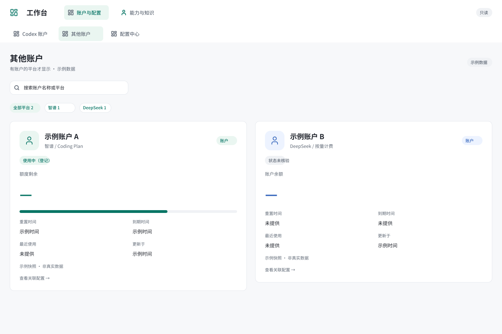

# Codex 工作台

为 Codex 提供统一的本机只读工作台：查看账户额度、筛选模型、浏览技能与资源，并通过受控通道查看配置。



## 功能

| 模块 | 功能 |
| --- | --- |
| Codex 账户 | 展示已登录账户的官方额度、重置时间与已提供的账户状态 |
| 其他账户 | 按平台筛选账户；进入页面时刷新已绑定 MiniMax Token Plan 的官方用量；失败保留上次快照 |
| 配置中心 | 目录、平台、类型与标签筛选；中文标题；普通字段与敏感字段分开展示 |
| 模型目录 | 按供应商、能力和状态筛选，支持中文名称和 MiniMax 常见拼写检索 |
| 技能助手 | 浏览 Codex 已发现的技能和能力说明 |
| 资源中心 | 预览技能内的图标、图片、字体及其他受限素材 |
| 知识中心 | 通过外部只读适配器查阅已审核的知识目录与内容 |

界面使用两级导航：“账户与配置”和“能力与知识”。MCP 只提供一个“工作台”入口，浏览器预览与 MCP 使用同一套只读服务。列表支持有界缓存与增量更新；页面恢复可见时更新，无定时业务轮询。

公开代码不含任何实际账户、模型服务登记、密码、API Key、登录态、个人业务记录或运行数据库。配置中的字段名与测试中的合成占位值用于说明协议。

## 运行

主要使用环境为 macOS。需要 Python 3.11+、已安装并由用户自行登录的官方 Codex CLI；构建界面还需要 Node.js。桌面内嵌页面取决于宿主是否支持 MCP Apps，不能保证所有 Codex 版本均兼容。

```sh
python3 -m venv .venv
.venv/bin/python -m pip install -r requirements.txt
.venv/bin/python launch.py preview
```

预览只监听本机回环地址。新环境没有账户或外部适配器时，相应模块会明确显示为空或来源不可用。

需要将 MCP 注册到自己的 Codex 配置时执行：

```sh
.venv/bin/python install.py
```

安装器会检查同名入口的来源，只更新本项目管理的配置段。注册是显式配置操作；普通页面读取不会安装、登录或改写账户。

可设置 `WORKBENCH_PYTHON` 指定 Python，`WORKBENCH_CODEX_PATH` 指定安装时使用的 Codex CLI，`WORKBENCH_RESOURCES_DIR` 指定非秘密资源目录。直接启动也支持 `--data-dir`、`--resources-dir`、`--codex` 参数。默认活动数据放在本机应用数据目录，不放在仓库。

### 外部适配器

密钥保险库和知识工具是可选外部依赖，本仓库不分发用户的私有工具、密文库或主密钥。适配器需要遵循 [接口说明](docs/adapters.md)。缺少适配器时，相应功能不可用；不得把密码写进示例 JSON 代替配置。

MiniMax 用量查询需要显式设置账户的 `usage_credential_id`，指向用户自己的 Token Plan Key。Key 只通过 stdin 交给隔离消费者，查询官方只读套餐接口，不调用付费生成接口。接口没有提供的到期日或最近调用时间保持未知。

仓库中的 `gateway_control.py` 及相关验证脚本是独立、可选的 macOS 工具，不会随只读工作台启动。真实网关认证、账户路由和模型验证必须由使用者另行配置并授权。

网关使用 `WORKBENCH_GATEWAY_ACCOUNT_IDS` 显式指定 JSON 账户白名单，默认仅 `["current"]`，必须包含当前账户且不能重复；部署设置保存该白名单，运行核心要求账户声明与其精确一致。CLI 验收的期望账户由 `WORKBENCH_GATEWAY_EXPECTED_ACCOUNT` 指定，默认 `current`。这些是本机引用，不是登录凭据。

## 开发验证

```sh
PYTHONPATH=src:tests .venv/bin/python -m unittest \
  test_readonly_service test_other_accounts test_account_usage \
  test_api test_mcp test_mcp_resource_isolation test_ui_release \
  test_runtime test_module_catalogs test_asset_catalog \
  test_credential_details test_credential_probe test_credentials \
  test_install test_titles
.venv/bin/python publish_ui.py
```

`publish_ui.py` 检查 JavaScript、页面状态及加密互操作，再生成 `ui/release.json`。Python 测试使用临时目录和合成数据，不需要真实账户或远端模型。

可选的真实浏览器回归：安装并配置 Playwright/Chromium 后，从仓库根目录运行 `node tests/ui-progress-browser.mjs`。可用 `WORKBENCH_PLAYWRIGHT_MODULE` 指定已有 Playwright 模块、`WORKBENCH_BROWSER_EXECUTABLE` 指定已有浏览器。此检查验证额度条的实际宽度、可见填充色、窄屏和零值／满值状态，使用合成数据。

## 当前版设计

[design/current](design/current/README.md) 仅包含 Figma 当前分组导航版的 4 张脱敏设计导出：其他账户、配置中心、未配置与读取失败。当前版目录不包含旧版横向导航、创建任务、账户管理等历史方案。应执行记录讨论需要，另在 [讨论参考](design/discussions/README.md) 保存一张明确标记为非当前功能的脱敏概念图。

导出图中的账户是通用示例，具体额度、余额和时间均已移除；不包含邮箱、服务器地址、密码或 Key。设计图说明布局与状态，实时数据与新增行为以代码为准。

## 隐私与授权边界

公开发布采用新的 Git 历史；不导入本机历史、旧 UI 副本、验收快照、会话标题映射或 Figma 旧版本。详见 [公开材料检查](docs/publication.md)。

本项目为独立开发的集成工具，并非 OpenAI 官方产品。第三方图标保留原始许可证；见 [素材来源](ui/assets/SOURCES.md)。本仓库暂未单独授予源码的开源许可，公开可见不等于放弃著作权。
