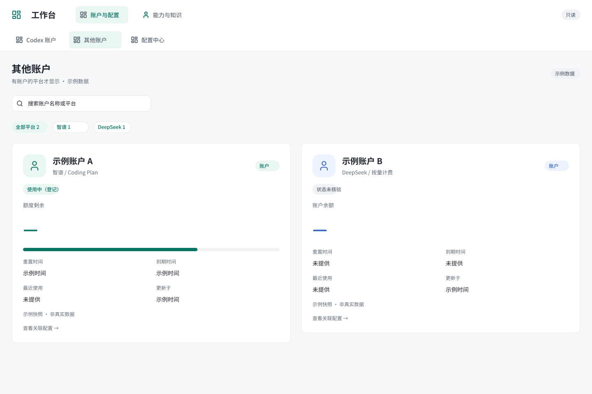

# Codex 工作台

为 Codex 提供统一的本机工作台：浏览账户与能力，按项目拆分工作并安排月历，并通过独立操作执行任务、管理账户。



## 功能

| 模块 | 功能 |
| --- | --- |
| 工作台 | 工作计划、项目跟踪、进度统计三个维度；按项目拆分工作，安排排期并查看进展 |
| 工作项附件 | 在详情查看上传文件、图片与执行输出，保留来源、版本和历史关联 |
| Codex 账户 | 添加并登录 Codex 账户，查看额度与重置时间，设置所有会话共用的默认账户 |
| 其他账户 | 按平台筛选账户；后台定期刷新已绑定账户的官方用量；失败保留上次快照 |
| 配置中心 | 目录与配置类型筛选、即时搜索；普通字段与敏感字段分开展示 |
| 模型目录 | 按供应商与能力筛选，展示调用验证状态，支持中文名称和 MiniMax 常见拼写检索 |
| 技能助手 | 按类型筛选已发现技能，即时搜索能力说明 |
| 知识中心 | 按知识范围筛选、即时搜索，通过外部只读适配器查阅已审核知识 |

MCP 只提供一个“工作台”入口，浏览器预览与 MCP 使用同一套服务；计划、资料及账户操作通过独立写入接口完成。账户与能力列表读取本机 JSON 快照并全量展示筛选结果；资料库采用分页检索。后台按模块关注程度定时采集，打开页面不等待来源接口；采集失败保留上次成功数据。

公开代码不含任何实际账户、模型服务登记、密码、API Key、登录态、个人业务记录或运行数据库。配置中的字段名与测试中的合成占位值用于说明协议。

详细说明见 [功能手册](docs/features.md)、[架构与扩展](docs/architecture.md) 和 [执行记录讨论方案](docs/execution-records-discussion.md)。默认账户切换属于显式写操作，所有任务与会话持续跟随当前默认账户；官方登录与历史记录保持各自归属。

## 可恢复功能分支

资源中心保存在 `feature/resource-center`，列表分页保存在 `feature/list-pagination`；两者以移除前的稳定主分支为恢复起点。执行记录保存在 `archive/execution-records`。这些分支用于保留实现，恢复时应基于当前开发分支移植对应改动并重新验证，避免直接合并旧快照覆盖后续功能。

## 工作计划、项目跟踪与进度统计

工作计划的文字入口可将一段描述整理为多个独立任务、已有任务的补充或问答。解析结果在统一弹框中修改项目、分区、排期和执行设置；模型不可用时保留原文供手动整理。确认保存只写入待执行内容，不自动运行。批量保存采用一次事务和操作编号，重试不会重复创建；相同文字的另一次独立提交仍会保留。

补充和问答作为独立记录追加，保留任务最初的说明。任务详情通过概览、对话、运行和附件页签展示上下文；已保存的问题须点击执行才启动，并关联自己的运行、原生会话、结果及实际用量。没有记录的用量不填造数值。已有知识关联、文件预览和下载、输出归档与 Obsidian 笔记入口继续可用。

当前任务是补充与问答的归属锚点；没有明确任务的短续答保留为待确认草案。交付证据绑定任务卡、补充材料、关联资料和运行输入指纹，材料变化后保留旧记录，但不能继续作为当前验收或知识提取依据。没有输入快照的历史运行也不能补记为当前证据。

任务详情中的“并行分工与依赖”可声明负责人、相对文件范围、共享资源和上游任务。执行前检查已声明的文件与资源冲突、上游验收状态；这些声明不替代操作系统权限、独立工作树或外部环境隔离。模型评审采用持久化的有界交接包，相同包不重复发送，提交结果未知时保留待核对状态；每条建议可记录采纳、拒绝或暂缓及理由。采纳不会自动修改文件或启动任务。

实际模型效果分别记录调用成功、质量、采纳、纠正次数、耗时与用量，缺失数据保留未知。知识候选引用确切的验收证据及核验时间，来源失效后提示重新核验；候选仍须经过独立审核才能成为已审核知识。

点击“工作台”标题直接显示月历，下方可切换“工作计划 / 项目跟踪 / 进度统计”，无单独的“项目管理”一级页签。工作计划用下拉框筛选项目，周日为每周第一列；周一至周五各用一种色系，周末共用第六种，过去日期及其中任务统一淡灰色。已过期任务在接口层禁止修改、删除、执行和关联新材料，已有附件仍可查看下载。跨日任务在过去日期入口只读，今天及未来入口在任务未过期时可编辑；正在执行的任务仍可通过停止接口安全取消。

项目跟踪完整展示项目卡片，可搜索项目或任务。卡片展示当前项目状态、完成比例与各状态数量；点击进入该项目的任务看板子页面，按未分配、待执行、执行中、已完成、需处理分列。未分配指待执行且未指定执行账户，未排期是独立属性。任务颜色由任务 ID 稳定生成，状态用文字与徽标表达，不能通过拖动伪造执行结果。项目状态根据全部任务计算，不受任务搜索影响。

进度统计可切换日、月、季度、年及项目，包含彩色指标、任务走势、当前任务和项目状态、多项目对比以及指标明细。周期按本地时间的闭开区间处理。本期项目包含排期相交、实际运行、新建任务或本期新建的项目。计划按截止日（缺截止日时按开始日）；执行与完成按完整运行历史的真实时间分别去重，重试不会重复增加周期任务数，跨期启动但本期完成仍计入完成。状态是当前快照，不声称还原历史状态。未来实际时间和缺失时间不补造，日图仅按小时绘制实际运行，日期级计划保留在指标卡。图表提供文本标签及数据表，不加载远程图表依赖。

可通过今天及未来日期的加号新建任务；任务也可保持未排期。跨日任务显示在覆盖日期中。草案生成使用模型目录中已验证的 MiniMax/GLM 推理模型；不可用时保留原文供手动编辑。保存、排期和记录追问都不会启动执行，只有点击“执行”才通过所选已登记账户调用官方 Codex；继续任务复用原会话。

附件在工作项详情中查看，不增加独立资料库导航。文件和图片保存在本机活动数据目录的 `library/files`，工作项只保存关联。每份资料记录稳定 ID、内容哈希、版本、来源与任务/执行批次；执行结果和专用输出目录中的文件会归档到资料库。单文件上限 32 MiB，删除任务保留资料和历史记录。只把用户显式选择的已审核知识加入任务。

`library` 同时提供 Obsidian 可读取的任务和资产 Markdown 笔记、Bases 索引及独立 `Drafts` 目录。任务数据库仍是执行状态的权威来源；检测到用户手工编辑时保留原笔记并提示冲突。此功能不自动启动 Obsidian、不启用同步，也不把草稿自动审核成知识。笔记格式参考 [Obsidian Skills](https://github.com/kepano/obsidian-skills) 与 [Bases 官方语法](https://help.obsidian.md/bases/syntax)。

## 运行

主要使用环境为 macOS。需要 Python 3.11+、已安装并由用户自行登录的官方 Codex CLI；构建界面还需要 Node.js。桌面内嵌页面取决于宿主是否支持 MCP Apps，不能保证所有 Codex 版本均兼容。

```sh
python3 -m venv .venv
.venv/bin/python -m pip install -r requirements.txt
.venv/bin/python launch.py preview
```

预览只监听本机回环地址。新环境没有账户或外部适配器时，相应模块会明确显示为空或来源不可用。

需要将 MCP 注册到自己的 Codex 配置时执行：

```sh
.venv/bin/python install.py
```

安装器会检查同名入口的来源，只更新本项目管理的配置段。注册是显式配置操作；普通页面读取不会安装、登录或改写账户。

可设置 `WORKBENCH_PYTHON` 指定 Python，`WORKBENCH_CODEX_PATH` 指定安装时使用的 Codex CLI，`WORKBENCH_RESOURCES_DIR` 指定非秘密资源目录。直接启动也支持 `--data-dir`、`--resources-dir`、`--codex` 参数。默认活动数据放在本机应用数据目录，不放在仓库。

### 默认账户与继续会话

在 Codex 账户页点击彩色“＋”卡片直接打开官方登录。只有登录成功并自动核验身份后才登记和显示账户；未登录、失败或超时不新增账户卡片。随后可点击“设为默认”。登录材料保留在本机的官方 Codex 独立账户目录；添加账户不会自动改变默认账户。

工作台模型网关实时读取当前默认账户。切换后，同一会话、同一任务轮次中的后续模型调用立即跟随新默认，无需新建任务或会话。已经发送的请求保持其发送时的账户，不中断、重放工具。任务领取时的账户快照用于历史审计，不作为后续请求的固定绑定；旧原生线程仍从原目录续接，上游账户由网关独立选择。默认账户不可用或网关未就绪时明确报错，不静默直连旧账户。

切换接口分别返回偏好保存结果和路由就绪状态。原生配置仍为直连、网关未启动或健康检查失败时，页面明确提示尚未在 Codex 中生效。网关兼容桌面应用官方 CLI 目录迁移，自定义失效路径不会被静默替换。

新准备的网关默认使用 `registered_accounts` 策略，允许新登录并登记的工作台账户动态接入，无需逐个重启网关。已有策略保持不变；从旧版 `fixed` 配置升级并启用动态切换时，显式运行 `WORKBENCH_GATEWAY_ACCOUNT_POLICY=registered_accounts python gateway_control.py prepare`，再运行 `python gateway_control.py start`，并核对设置中的策略与网关健康状态。固定授权仍可通过 `WORKBENCH_GATEWAY_ACCOUNT_POLICY=fixed` 显式选择。HTTP 模式由 Codex 携带完整上下文；跨账户的服务器 `previous_response_id` 引用无法代替上下文，网关会拒绝这种不完整请求而非静默丢失历史。

### 后台快照与账户资料

后台进程按 `refresh-schedule.json` 采集公开列表；可在资源目录放置同名文件覆盖间隔。`provider_timers_enabled` 仅接受布尔值，默认 `false`：关闭时用量任务等待 Codex 自动化请求，开启时由工作台按 `provider_tasks` 的间隔和相位后台调度。最近 15 分钟访问过的模块使用活跃频率，其余使用空闲频率：账户 1/5 分钟、其他账户与配置 5/30 分钟、模型与知识 10/60 分钟、技能 30/360 分钟。最多同时采集三个模块，同一模块不会重复并发采集。页面仅查询本机快照，手动刷新只加入后台队列。

快照保存在本机数据目录的 `snapshots.json`，原子写入并使用仅当前用户可读写的权限；来源失败保留上次结果。初次没有数据时显示采集中，不将尚未取得的分类统计显示为零。首次官网确认的昵称和头像保存在同目录 `account-profiles.json`，按账户身份与凭据引用匹配，实时官方字段优先；缺失字段沿用已确认资料，不以邮箱冒充昵称。该文件不包含密码、Cookie 或会话材料，也不进入仓库。

### 外部适配器

密钥保险库和知识工具是可选外部依赖，本仓库不分发用户的私有工具、密文库或主密钥。适配器需要遵循 [接口说明](docs/adapters.md)。缺少适配器时，相应功能不可用；不得把密码写进示例 JSON 代替配置。

MiniMax 用量查询需要显式设置账户的 `usage_credential_id`，指向用户自己的 Token Plan Key。Key 只通过 stdin 交给隔离消费者，查询官方只读套餐接口，不调用付费生成接口。接口没有提供的到期日或最近调用时间保持未知。

仓库中的 `gateway_control.py` 及相关验证脚本是独立、可选的 macOS 工具，不会随只读工作台启动。真实网关认证、账户路由和模型验证必须由使用者另行配置并授权。

网关使用 `WORKBENCH_GATEWAY_ACCOUNT_IDS` 显式指定 JSON 账户白名单，默认仅 `["current"]`，必须包含当前账户且不能重复；部署设置保存该白名单，运行核心要求账户声明与其精确一致。CLI 验收的期望账户由 `WORKBENCH_GATEWAY_EXPECTED_ACCOUNT` 指定，默认 `current`。这些是本机引用，不是登录凭据。

## 开发验证

```sh
PYTHONPATH=src:tests .venv/bin/python -m unittest \
  test_readonly_service test_other_accounts test_account_usage \
  test_api test_mcp test_mcp_resource_isolation test_ui_release \
  test_runtime test_module_catalogs \
  test_credential_details test_credential_probe test_credentials \
  test_install test_titles
.venv/bin/python publish_ui.py
```

`publish_ui.py` 检查 JavaScript、页面状态及加密互操作，再生成 `ui/release.json`。Python 测试使用临时目录和合成数据，不需要真实账户或远端模型。

可选的真实浏览器回归：安装并配置 Playwright/Chromium 后，从仓库根目录运行 `node tests/ui-progress-browser.mjs`。可用 `WORKBENCH_PLAYWRIGHT_MODULE` 指定已有 Playwright 模块、`WORKBENCH_BROWSER_EXECUTABLE` 指定已有浏览器。此检查验证额度条的实际宽度、可见填充色、窄屏和零值／满值状态，使用合成数据。

## 当前版设计

[design/current](design/current/README.md) 仅包含 Figma 当前分组导航版的 4 张脱敏设计导出：其他账户、配置中心、未配置与读取失败。当前版目录不包含旧版横向导航、创建任务、账户管理等历史方案。应执行记录讨论需要，另在 [讨论参考](design/discussions/README.md) 保存一张明确标记为非当前功能的脱敏概念图。

导出图中的账户是通用示例，具体额度、余额和时间均已移除；不包含邮箱、服务器地址、密码或 Key。设计图说明布局与状态，实时数据与新增行为以代码为准。

## 隐私与授权边界

公开发布采用新的 Git 历史；不导入本机历史、旧 UI 副本、验收快照、会话标题映射或 Figma 旧版本。详见 [公开材料检查](docs/publication.md)。

本项目为独立开发的集成工具，并非 OpenAI 官方产品。第三方图标保留原始许可证；见 [素材来源](ui/assets/SOURCES.md)。本仓库暂未单独授予源码的开源许可，公开可见不等于放弃著作权。

## 会话调用与模型验证状态

模型目录读取本机 `model-observations.sqlite3` 中与当前配置匹配的调用终态。成功显示“验证通过”，没有记录显示“未验证”，较新的失败显示“上次验证失败”。状态绑定模型 ID、地址、协议、能力与凭据引用；同一 Key 的其他模型不继承，配置变化后旧结果不适用。更换同一保险库引用中的 Key 时，调用方必须重新核验并记录结果。

会话中的调用可能来自 Shell、外部插件或其他服务，工作台不会仅凭会话完成、模型名称出现、HTTP 200、Key 查询成功或视频任务已受理就认定生成成功，也不自动扫描会话正文。调用方负责在具体模型实际完成生成后登记：

1. 调用前执行 `python record_model_call.py --resources-dir <资源目录> --data-dir <本机数据目录> --model-id <目录模型ID>`，保存返回的配置指纹，并使用该配置调用。
2. 核对实际生成结果后，再执行同一命令，加上 `--outcome verified --fingerprint <调用前的指纹> --observed-at <带时区的实际调用时间>`。实际模型调用失败使用 `--outcome failed`；取消、未发起调用、仅账户查询均不记录。
3. 视频等异步调用必须等最终产物生成成功再记录。补录历史结果必须核对当时连接、模型与凭据引用，不能使用当前配置猜测历史。无法确认的保留未验证。

此命令只记录由调用方核实的结果，不自行验证结果真实性或发起模型请求。记录不包含提示词、回复、服务器地址或 Key，保存在本机数据目录；模型列表、详情与关联服务详情通过同一投影读取，记录变化后下次读取使缓存失效。页面与 MCP 以只读浏览为主；设置默认账户属于明确的本机偏好写操作。

Codex 账户按登记主体分别保存 `account-snapshots/<账户摘要>/profile.json`（低频资料）与 `usage.json`（高频额度）。首屏直接读取已有资料，额度更新成功后仅合并返回的字段；读取失败保留原值与原成功时间，并显示失败状态。`refresh-schedule.json` 中 accounts 的 `profile_seconds` 默认为 86400 秒，额度沿用 active_seconds/idle_seconds。登录已注销、主体不匹配或登记绑定改变时不复用旧主体数据。首次升级只从已确认邮箱匹配的公开历史快照恢复显示数据，不恢复认证材料。
